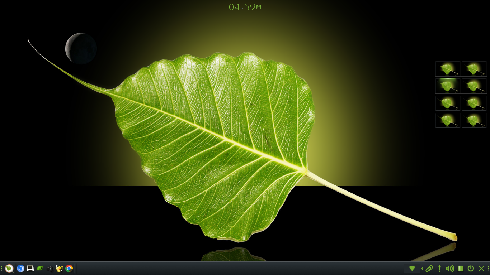

[](https://www.paypal.com/paypalme/rbtylee)

# Moksha Moon Module

This module is a port of the old e17 Moon Module. It supplies a gadget that displays the current phase of the moon on your desktop or shelf.



## Dependencies

The usual enlightenment build tools: meson, libtool, intltool, pkg-config

* [EFL](https://www.enlightenment.org/download)

As well as:

* [Moksha](https://github.com/JeffHoogland/moksha)

## Installation

Bodhi users (BL7 or later) can install via apt:

```ShellSession
sudo apt update
sudo apt install moksha-module-moon
```

All other users have to compile from code.

First, install all the needed dependencies. Note this includes not only EFL but the EFL header files. If you have compiled and installed EFL, and Moksha from the source code this should be no problem. 

Then the usual:

```ShellSession
meson . build
ninja -C build
sudo ninja -C build install
```

## Usage

Module loading: Menu->Settings->Modules->Utilities

Placing the gadget on the desktop:
Menus->Settings->Gadgets->Background

## Reporting bugs

Please use the GitHub issue tracker for any bugs or feature suggestions.

## Contributing

Help is always Welcome, as with all Open Source Projects the more people that help the better it gets!

Please submit patches to the code or documentation as GitHub pull requests!

Contributions must be licensed under this project's copyright (see COPYING).

## Help Wanted

We are always looking for improved or new translations of non-English languages. So a great way to help is to contribute any missing translations or improve some of existing translations.

Developers may wish to look over our todo file and help implement future features.

Thanks in advance.

## Support This Project

This module is part of our current project to restore all broken e17 modules we know about. These modules can be broken by Moksha or enligtenment code changes or EFL API changes or in this case simply are unfinished or left in an unpolished state.

Donations to [Bodhi Linux](https://www.bodhilinux.com/donate/) would be greatly appreciated and keep our distro moving along. But if you like the work we do for Bodhi and wish to see more of it, we'd be happy about a donation. You can donate via [PayPal](https://www.paypal.com/paypalme/rbtylee).

## Liscense

This software is released under the same License used in many of the other Enlightenment projects. It is a custom license but fully Open Source. Please see the included [COPYING](https://github.com/rbtylee/moksha-moon-module/blob/master/COPYING) file and, for a less legalese explanation, [COPYING-PLAIN](https://github.com/rbtylee/moksha-moon-module/blob/master/COPYING-PLAIN).

Simply put, this software is free to use, modify, and redistribute as you see fit. I would like you to please keep the copyright notice the same in any modifications.

## Credits

Reusing code from the original Moon module:

Created by:

* David Stevenson <david.35472@gmail.com>

Bodhi specific modifications:

* _*Robert Wiley*_
* _*Štefan Uram*_

